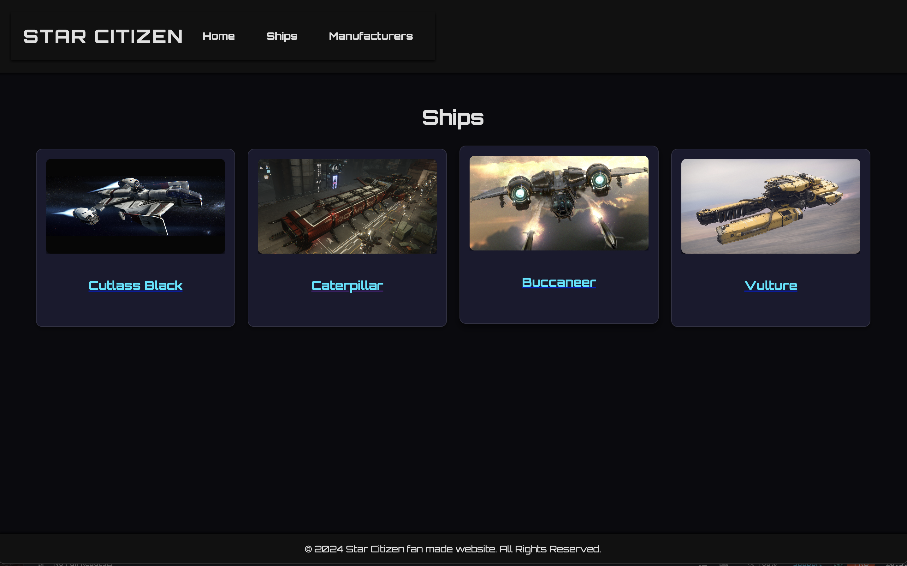
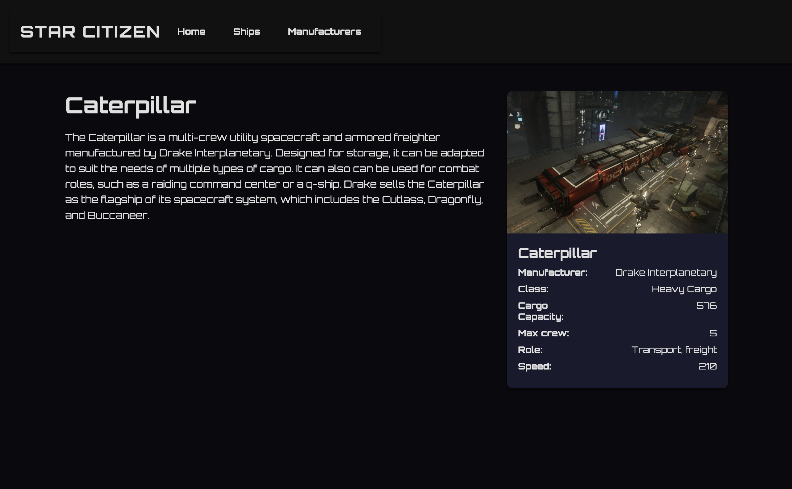

# Star Citizen fan made website

Hello, this is fan made website to train my new knowledge in Angular

# Disclaimer

SCG hasn't provided an api to retrieve data such as ships for personal use and the various api created by the community haven't convinced me yet, so I created my own .json and hosted a server locally.

the `dashboard` is still in work progress

You are free to use my work but if you can credit me that will be great

## How to test

Do `ng serve` and `json-server --watch json-server/db.json --port 3000` 

## Feature

You can click on the button in nav bar to display ships or manufacturers

When you are on the ships page, you can click on the ship of your choice and the details will be displayed.

## Images exemple

